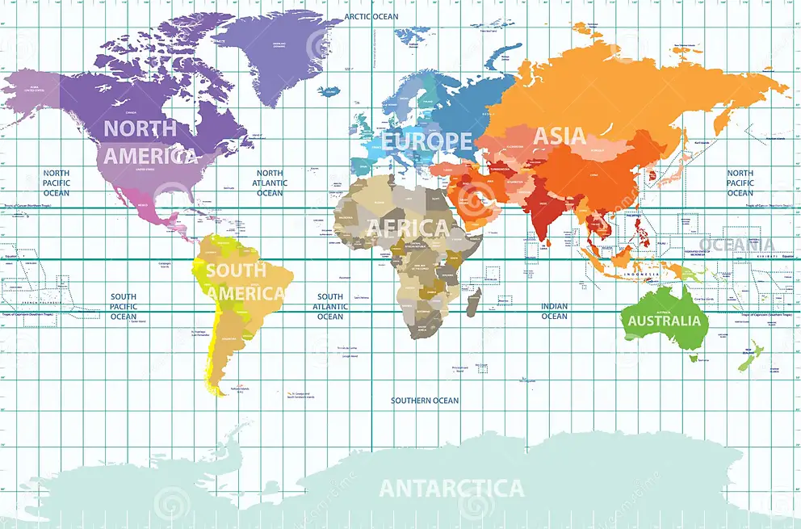

# python-api-challenege

**Summary**

Weather.py script first gives a list of Cities whose Longitudes and Latitudes are randomly generated and City name are generated based on those cooridnates with the help of citipy. Then requests for each city is made to OpenWeatherMap API using For loop and Data such as Coordinates, Maximum Temprature, Humidity, Cloudiness, Wind Speed, Country and Date of that obeservation is fetched and stored in a Dataframe as well as a CSV file for next step.And Data for each type of weather condition is plotted using scatter plot against the Latitude which helps find out the effects on the Weather conditions if Latitude changes. Then, it divides the dataframe into two parts based on the latitude, Obeservations with Latitude more than zero goes in Nothern Hemisphere Dataset and Latitude less than zero goes in Souther Hemisphere Dataset. And Data is again plotted for both type of Hemispheres for each Weather Condition against Latitude but now it also includes trendline(calculated using Linregress function) to show the trend vividly.

Vacation.py script read from the CSV file obtained from Weather.py. Then changes the Latitudes and Longitudes to Float values just in case they are strings and then plot the cities using hvplot on World map where size of the point depends on the amount of Humidity. And then, Filters the data based on the Temprature(Between 21 and 27 in Celsius), Cloudiness(0) and Wind Speed(Less than or equal to 5) to find the ideal location for vacation, which then be condensed to fewer columns dropping the columns such as City_ID, Date, Max Temp, Cloudiness and Wind Speed and a column for Hotel name is added to store the hotel near the center of the respective city.
The script the makes a call to Geoapify API to retrieve the hotel name based on Latitude and Longitude for each city in the condensed dataframe and saves the the hotel name in the dataframe as per the corresponding City and add "No hotel found" where the API doesn't have any hotel for that City. Those Hotel names retrieved then plotted onto World map only for the Cities in which hotel was found.

**Analysis**

As we check the Latitude Vs. Maximum temprature for both Northern Hemisphere and Southern Hemisphere. Temprature tends to decrease as we go away from the equator (latitude = 0), either in North(where latitude is greater than zero) or South(where latitude is less than zero) in both graphs, based on the line regression. 

While, upon checking the Latitude Vs. Humidity for Northern Hemisphere. Humidity tends to increase as we go north(as Latitude increases) but when checking the same for Southern Hemisphere. Humidity is lower in southern most region(where latitude is least) and increases as we move toward the equator.

Furthermore, The  trend seen in case of Latitude Vs. Cloudiness is same as Latitude Vs. Humidity, for both Northern and Southern Hemispheres.

Moreover, Upon checking the Latitude Vs. Wind Speed in Northern Hemisphere, it tends to remain same through the way from Equator (latitude = 0) to North Pole(latitude = 90) based on Linear equation but scatter plot suggest that Windspeed data is scattered all over the graph. While in case of Southern Hemisphere, Windspeed has just minor decrease as we go toward equator(latitude = 0).
